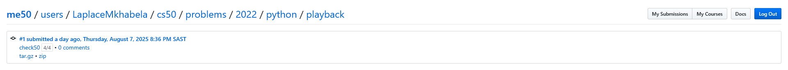
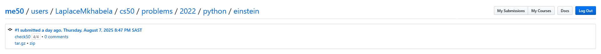
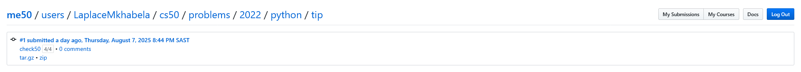

# Week 0

## Tests
Passed all the tests

### Indoor Voice

### Playback Speed

### Making Faces

### Einstein

### Tip Calculator

## Comments
I am already familiar with python functions and variables the lecture was
great revision for me.