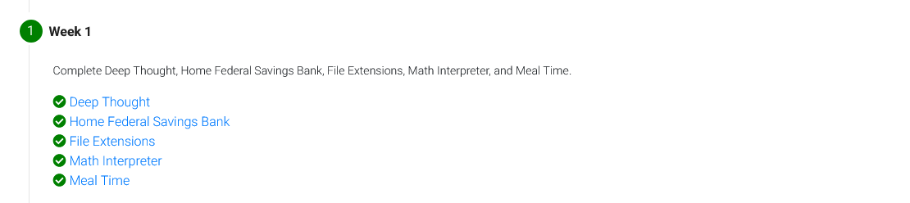
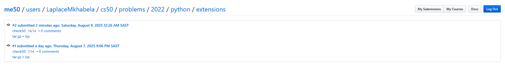
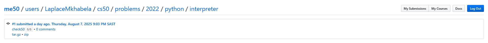
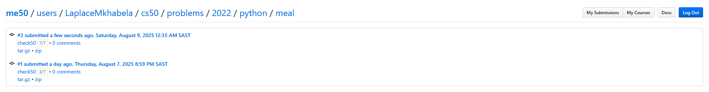

# Week 1

## Tests
Passed all the tests

### Deep Thought

### Home Federal Savings Bank

### File Extensions

###  Math Interpreter

###  Meal Time

## Comments
Relearning conditionals has been an unexpectedly fun and rewarding experience!. Even though I'm comfortable with Python, going back to if-elif-else logic, boolean expressions, and pattern matching with match has been surprisingly enjoyable.