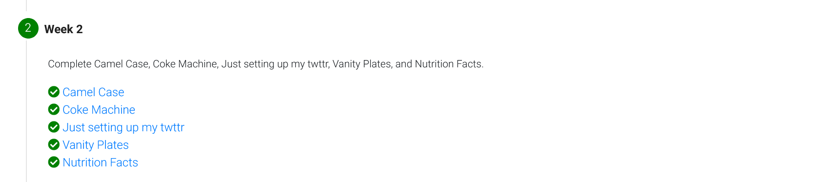
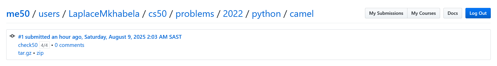
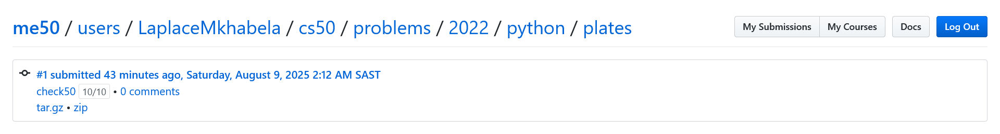
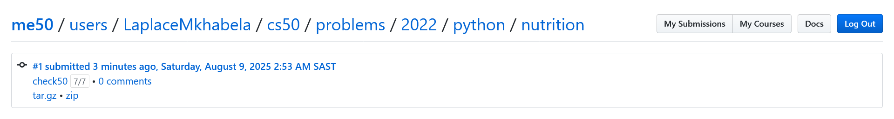

# Week 2

## Tests
Passed all the tests

###  Camel Case 

###  Coke Machine 

### Just setting up my twttr 

###  Vanity Plates 

###   Nutrition Facts 

## Comments
Working through loops again has been a valuable refresher on writing efficient and maintainable iteration logic. 
I love how python approaches **for loops it very different to how I'm used to doing it in C++.