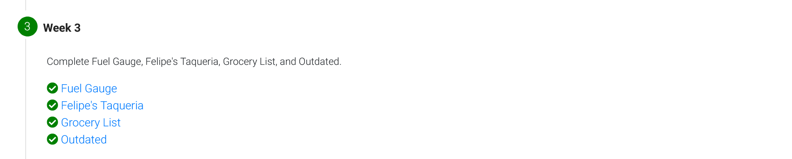
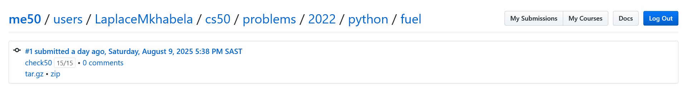
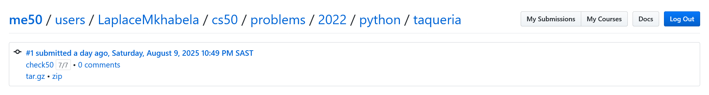
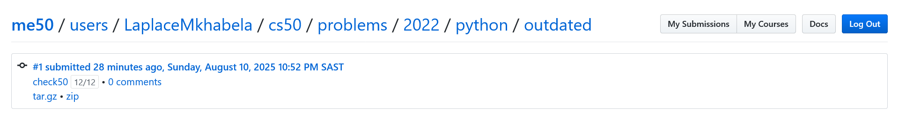

# Week 3

## Tests
Passed all the tests

###  Fuel Gauge

###  Felipe's Taqueria

###  Grocery List

###  Outdated

## Comments

This has been by far the most challenging section of the course
Learning defensive programming and handling errors that may occur in user input has fun.

### Positives
A win for me this week was being able to gain deep insight into 
the different types exceptions,how to use *raise* and the *try* *except* statements. 

### Negatives
So far I have no issues with the course,I just need more time to
grasp how variable scope works in python.
