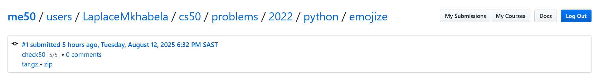
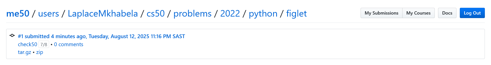
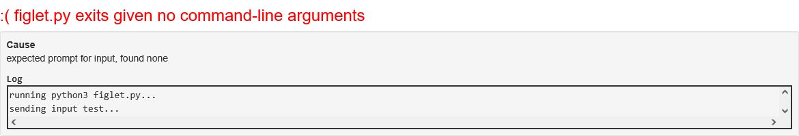
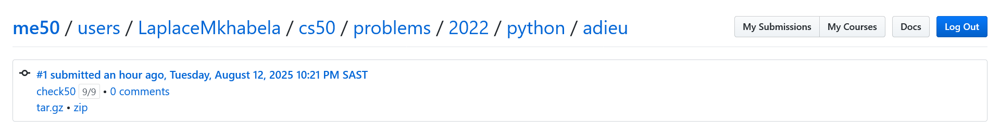
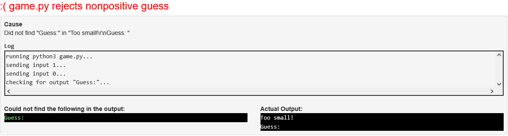
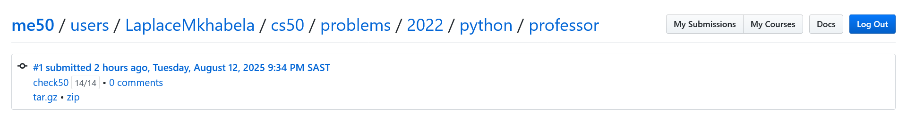
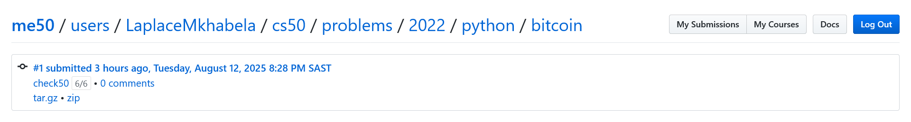

# Week 4

## Tests
Passed most of the tests

###  Emojize

###  Frank, Ian and Glen's Letters

I failed resolving the following error

###  Adieu, Adieu

###  Guessing Game

This test was also not passed,even though in my terminal the code behave as described

###  Little Professor

###  Bitcoin Price Index
I had alot of fun with this particular program

## Comments

This has been by far the most intresting and fun section of the course for me,I learned alot about modules in python.

### Positives
A win for me this week was being able to solve all the problems in the set alot quicker than the previous week and also 
the problems were alot more intresting this week, I had fun 🙂

### Negatives
The documentation for the inflect module was very not descriptive that slowed me down a bit.
The two failed test set me several hours in debugging,the logic in those tests does not seem consistent with the 
problems in my oppinion.
